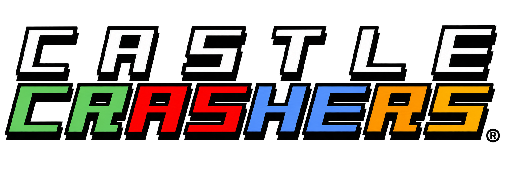

# Castle Crashers Recomp

A native reimplementation of the engine of Castle Crashers (the 2012 PC
Steam build): the SWF renderer, timelines, the ActionScript interpreter and
the game's natives, menus, input, saves, collision and sound. The game itself,
its art, its levels and its scripts, comes from your own copy: nothing of it
is in this repository.

It also builds for the GameCube:
[CCGC](https://github.com/myuu-151/CCGC) compiles this engine for the console.

## What you need

- **Castle Crashers, from Steam.** Installed through Steam, it's found by
  itself; downloaded another way (a depot download, which Steam doesn't list),
  give its folder, the one with `castle.exe` and `data/`.
- **Python 3**, for making the assets.
- **CMake** and **Visual Studio 2026** with C++ (SDL3, libtess2 and stb are
  fetched by CMake).

## Making the assets

From your copy of the game, into `assets/` (which git ignores):

```sh
python tools/make_assets.py [--game <the game's folder>]
```

It finds the game (the folder given, or `CC_GAME` in the environment, else
through Steam's own records, app 204360) and checks some of its files are the
Steam copy's. Then it decrypts the game's `.pak` archives, unwraps the SWFs
from their wrappers and rewrites their scripts' fused actions into standard
ones, reads the text from `castle.exe`, and takes the collision, fonts,
shaders, sound and music as they are.

## Building

```sh
cmake -S . -B build -G "Visual Studio 18 2026" -A x64
cmake --build build --config Release --target castle
build/Release/castle.exe
```

Progress is saved in `castle_save.dat` next to the executable. F1 pauses the
engine and F2 steps a frame. F3 writes the current movie's state (its tree,
every named clip's variables, what holds input) to `state_dump.txt` next to
the executable. Without a window: `--shot TICK out.png`, `--layers TICK dir/`,
`--export dir/ SCALE`, `--dump TICK` (the same state as F3).

Every session played is recorded to `sessions/session-DATE-TIME.txt` next to
the executable (the save it began from, every update, every change of input):
`castle.exe --replay FILE --dump TICK` (or `--shot`) replays it exactly, to see
what happened at any tick of a bug met while playing.

### Testing switches

- `CASTLE_LEVEL=N`: the first level the game loads is level N instead (20 is
  Tall Grass Field).
- `CASTLE_MAX=N`: that character maxed in the save, level 99 with every stat 25
  (1 the green knight, 2 the red, 3 the blue, 4 the orange).
- `--mod NAME`: replacement graphics from `mods/NAME/`, off by default (see
  `mods/README.md`).

## Layout

| Path | Contents |
|---|---|
| `engine/` | The engine: SWF rendering, timelines, the ActionScript interpreter, natives, menus, input, saves, collision, sound |
| `tools/` | `make_assets.py` and the steps it runs |
| `mods/` | Optional replacement graphics (`--mod NAME`) and how to make them |
